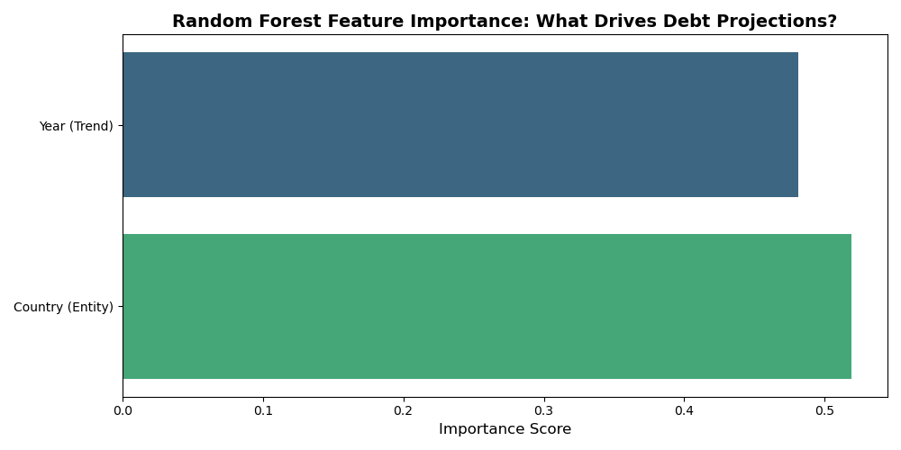
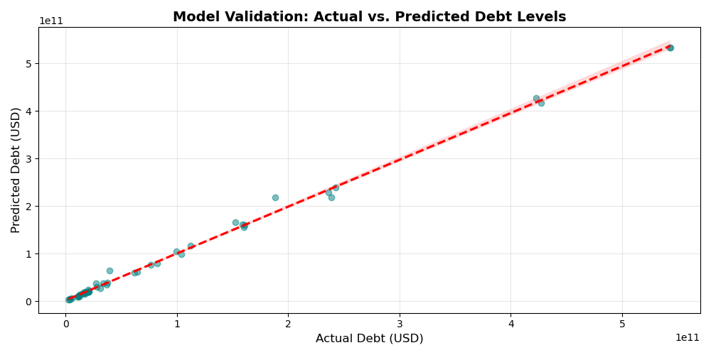

# Sovereign-Debt-Sustainability-Predictive-Analytics-A-Machine-Learning-Study-for-LAC-Region
## 🤖 Machine Learning Performance & Explainability

To ensure high-fidelity projections, a **Random Forest Regressor** was utilized. The model's reliability was validated through two key metrics:

### 1. Feature Importance

*Insight: The model identifies that both temporal trends (Year) and specific country profiles (Country Code) are equally critical in determining sovereign debt levels.*

### 2. Model Validation (Actual vs. Predicted)

*Insight: With an R² score of 0.99, the model shows minimal variance between actual World Bank data and our AI projections, ensuring stable decision-making for fiduciary oversight.

🤖 머신러닝 성능 및 설명 가능성 (Machine Learning Performance & Explainability)
고정밀 예측을 보장하기 위해 Random Forest Regressor 모델을 활용했습니다. 모델의 신뢰성은 두 가지 주요 지표를 통해 검증되었습니다.

1. 특성 중요도 (Feature Importance)
통찰: 모델은 시간적 추세(연도)와 특정 국가 프로필(국가 코드)이 국가 부채 수준을 결정하는 데 있어 동등하게 중요하다는 점을 식별합니다.

2. 모델 검증: 실제값 vs 예측값 (Model Validation)
통찰: 0.99의 R² 점수를 통해 모델은 실제 세계은행(World Bank) 데이터와 AI 예측 간의 편차를 최소화하며, 신탁 감독(fiduciary oversight)을 위한 안정적인 의사 결정을 보장합니다.
